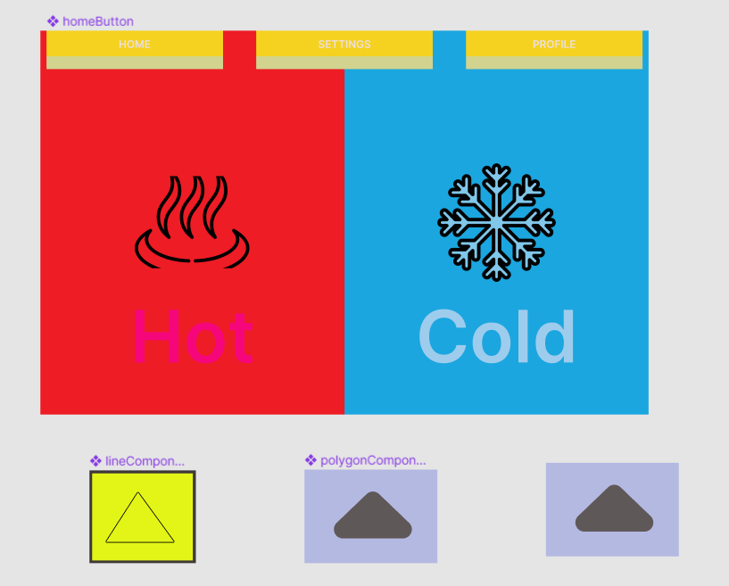

# Qt Bridge for Figma
You can use Qt Bridge export plugin to convert your Figma projects into metadata format supported by Qt Design Studio.

## Figma
+ Supports Components
+ Converts Rectangles into Qt Quick
+ Converts Vectors into SVG Path Items
+ Can Export PNG's, SVG's and JPG's
+ Supports property overrides
+ Converts design into functional QML code using the Figma bridge.

## Example

